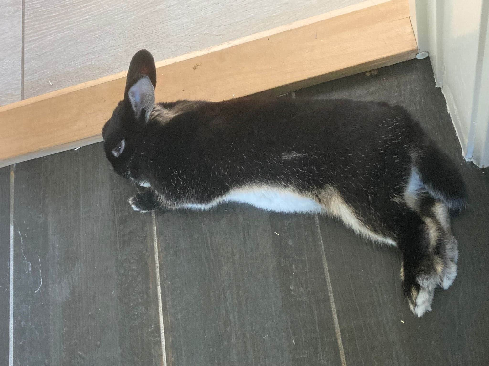
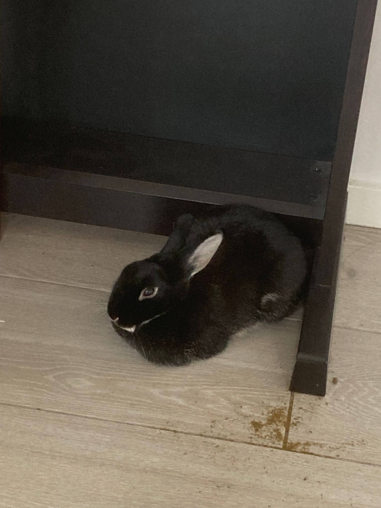
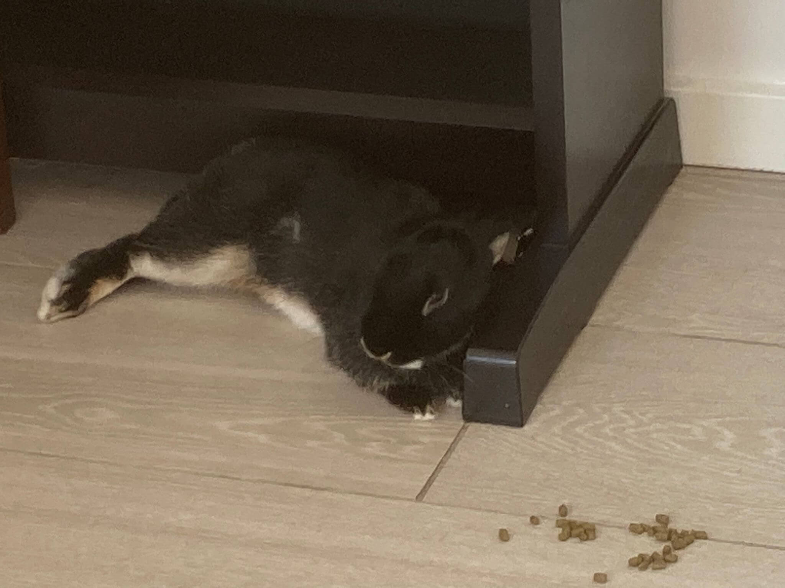

# Rabbit Gallery

Here are some of my most adorable moments:

<!--

-->

<!--

-->

  
  
  
  

{: style="width: 300px;"}
{: style="width: 300px;"}
{: style="width: 300px;"}
{: style="width: 300px;"}
